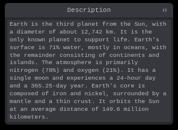

# Tweakpane note plugin

Simple multiline readonly note for [Tweakpane][tweakpane].



## Installation

### Browser

```html
<script type="module">
	import {Pane} as Tweakpane from './tweakpane.min.js';
	import * as TweakpaneNotePlugin from './tweakpane-plugin-note.min.js';

	const pane = new Pane();
	pane.registerPlugin(TweakpaneNotePlugin);
</script>
```

### Package

```js
import {Pane} from 'tweakpane';
import * as TweakpaneNotePlugin from '@tweakpane/plugin-note';

const pane = new Pane();
pane.registerPlugin(TweakpaneNotePlugin);
```

## Usage

```js
const params = {
	content: `Lorem ipsum dolor sit amet consectetur adipisicing elit. Minima, ipsam sequi iste amet labore unde omnis provident sed eligendi beatae nesciunt tempora officia totam pariatur, saepe voluptates deserunt illo! Doloremque?`,
};

// Important! The "readonly" parameter must be added with the value true.
pane.addBinding(params, 'content', {
	readonly: true,
	view: 'note',
});
```

## Version compatibility

| Tweakpane | Note plugin |
| --------- | ----------- |
| 4.x       | 0.1.x       |

[tweakpane]: https://github.com/cocopon/tweakpane/
